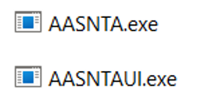
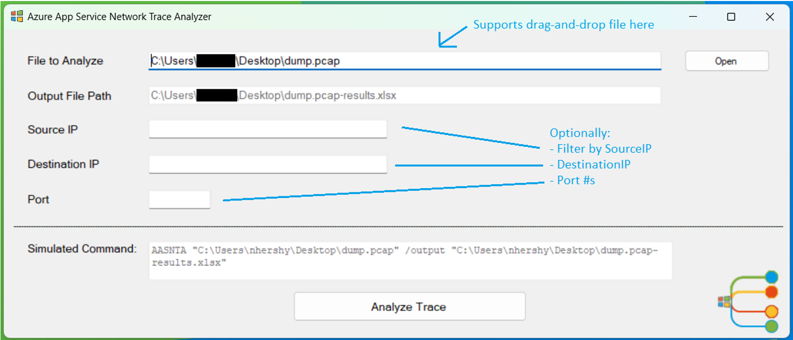
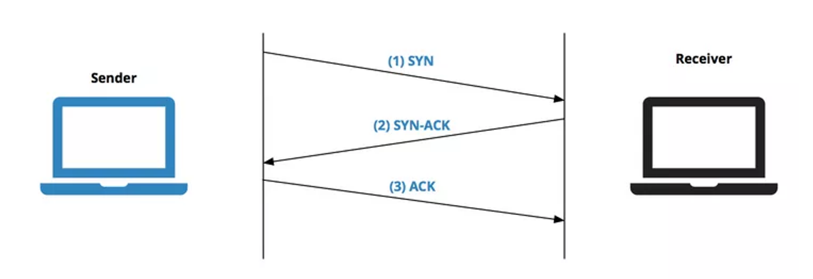
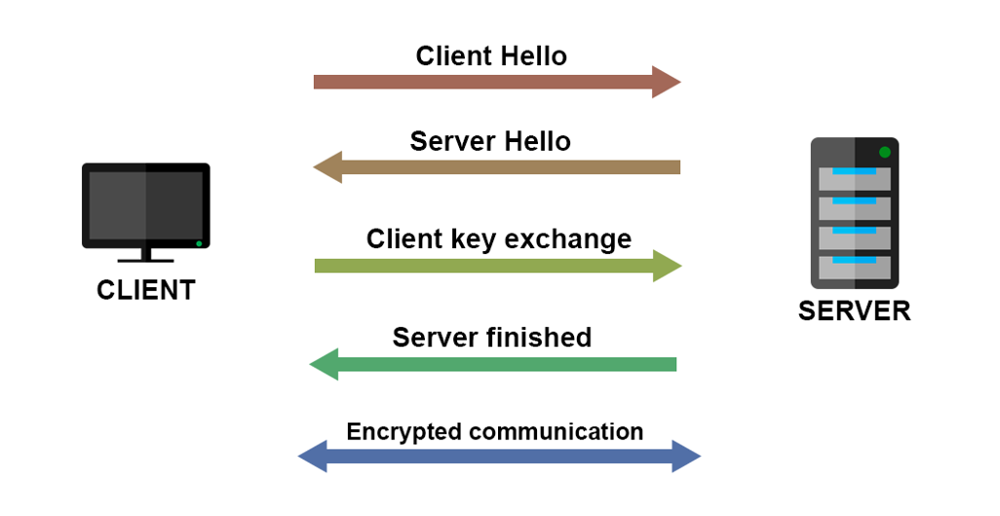

# Azure App Service Network Trace Analyzer

## Purpose
The purpose of this tool is to facilitate the inspection of network traces by non-networking experts. It is designed to easily identify if there are surface-level networking issues contained the trace. 

## How To Use
There are two executables that must reside in the same folder: a command-line application `AASNTA.exe` and a graphical interface application `AASNTAUI.exe`. The UI is used to select files for parsing and builds the appropriate CMD command to pass to the main application: `AASNTA.exe`

  

 
Opening up the UI.exe, the user is greeted by a simple interface that has parameters for input file, output file, source IP, destination IP, and port number. 

##### AASNTAUI

  

“File to Analyze” is the only **required** field. “Output File Path” is read-only, and auto-generated by the input file selected. “Source IP”, “Destination IP”, and “Port” are all optional parameters to filter the data on those supplied values. “Analyze Trace” will run the program and generate an Excel file as output.  

### How to Interpret the Output File
Once the trace has been analyzed, an Excel file will be shown to the user and simultaneously saved to the “Output File Path” shown above. These headers will be generated in the Excel file:

|                       |                     |                      |                  |                            |
|-----------------------|---------------------|----------------------|------------------|----------------------------|
|     SourceIP          |     SourcePort      |     DestIP           |     DestPort     |     IPVersion              |
|     Protocol          |     Syn             |     Fin              |     Reset        |     AckSynDelayms          |
|     Retransmit        |     ClientDup       |     ServerDup        |     KeepAlive    |     PacketVisualization    |
|     TLSVersionUsed    |     TLSVerClient    |     TLSVerServer     |     StartTime    |     EndTime                |
|     Duration          |     ClientTTL       |     ClientLowHops    |     ServerTTL    |     ServerLowHops          |

The real magic of this program is the **PacketVisualzation**. This shows all the frames sent between the client and the server for a single conversation. Each network trace contains one or more conversations. And each conversation contains a multitude of corresponding frames. 

The program outputs the Excel file with conditional highlighting to signify potential issues. These issues will be a “best guess” and it is still up to the user to use their own judgement to discern if a real issue exists or not. 

#### Packet Visualization Legend

|     Symbol       |     Meaning                                                                                           |
|------------------|-------------------------------------------------------------------------------------------------------|
|     >            |     Packet from the client                                                                            |
|     <            |     Packet from the server                                                                            |
|     S            |     SYN                                                                                               |
|     A            |     ACK                                                                                               |
|     SA           |     SYN/ACK                                                                                           |
|     F            |     FIN                                                                                               |
|     R            |     RST                                                                                               |
|     D            |     PSH (push of **D**ata from sender)                                                                |
|     ED           |     **E**ncrypted **D**ata   (only seen after TLS Handshake)                                          |
|     CH           |     Client Hello                                                                                      |
|     SH           |     Server Hello                                                                                      |
|     KE           |     Key Exchange (this is not always visible in Packet Visualization,   don’t rely on seeing this)    |
|     >S <SA >A    |     Successful 3-Way Handshake                                                                        |
	

##### Three-Way Handshake
One of the most fundamental networking protocols is the TCP three-way handshake, used to establish a reliable connection. Each “healthy” connection should start with a complete three-way handshake (>S <SA >A). If the handshake does not complete successfully, or multiple “>S” attempts are sent from the client – with no response from the server – this conversation will be highlighted in red to signal a potential issue. 

  

 
##### TLS Handshake
TLS handshake is responsible for establishing a secure connection between a client and a server. When you visit a website via HTTPS, TLS handshake happens between your browser and the web server, so your browser can communicate with the web server via a secure connection. If there was a Client Hello, but no Server Hello response, there could be an issue. This will be highlighted in red. You may not see Key Exchanges in the Packet Visualization, as this data was hard to decipher due to its encrypted nature. However, you can assume a successful TLS Handshake if after the CH and SH frames follow ED (Encrypted Data) frames. 

  

##### Reset
Any Resets found in the conversation show premature disconnection and are a potential issue. These will be highlighted in red. 

##### Retransmits 
Any Retransmits that are found in the conversation will be marked in yellow as a warning, as long as the protocol type is TCP (not UDP/DNS). Retransmits are shown in their own column in the excel file.

##### FIN
If there is not a FIN sent from both the client and the server towards the end of the conversation, the conversation will be marked in red. 

##### Healthy Conversation
If there is a successful 3-Way Handshake, no Resets, and FINs from client and server, the conversation will be marked in green denoting a successful connection and no issues found. 

##### Ongoing Conversation
Sometimes a packet capture can be started in the middle of a conversation that has already taken place between client and server. So, you may not see any 3-way handshake initiation, nor any FIN endings. You may just see ACKS and Data Transfer in the conversation. This may not be an error. Therefore, these do not have any highlighting. 

#### Additional Info

| Supported Filetypes |
|---------------------|
|     .cap            |
|     .pcap           |
|     .pcapng         |
|     .etl            |

